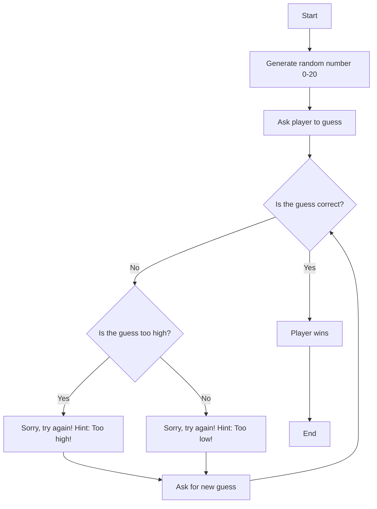

# Guessing Game Flowchart
## Description
-Below is a flowchart of the guessing game that was created. The flowchart clearly illustrates the steps of the game, the two possible outcomes, and how to win. 

The game starts with a random number generated for the player to guess. Once the number is generated, the player is asked to make a guess. If the guess is correct, the player wins and that concludes the game. If the player’s guess is incorrect, they will be be provided with a hint that indicates if their guess was too high or too low. The player will then have a chance to make another guess. The game will continue on like this until the player guesses the correct number and ends the game. 

